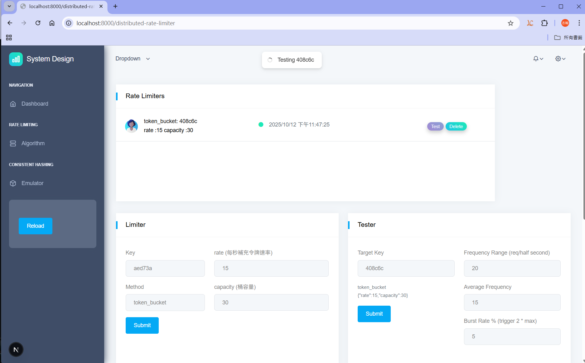
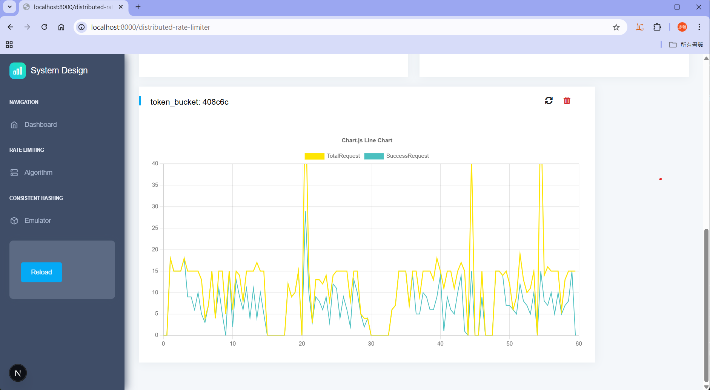
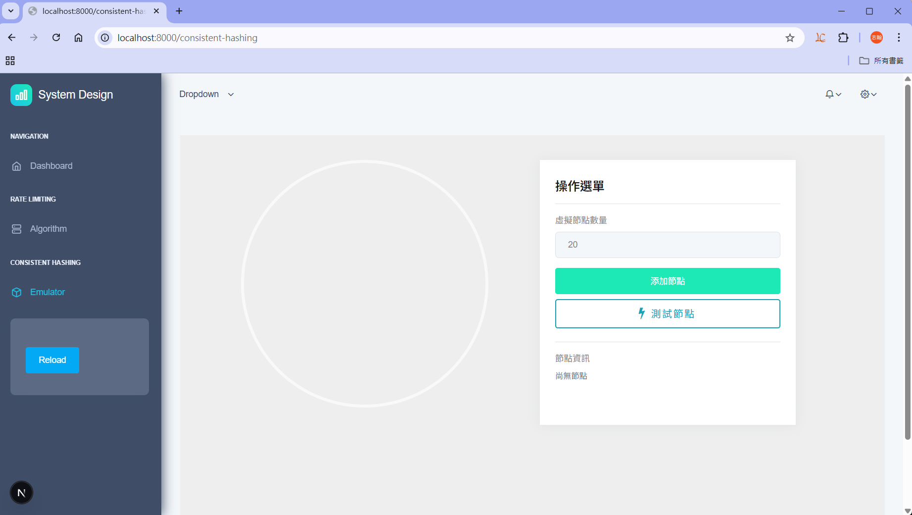
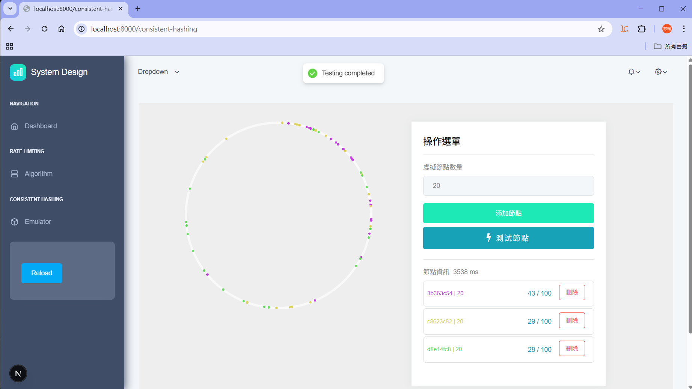

# System design practice

實作 《系統設計面試指南》 介紹的服務，以 k8s 架設使用工具

-  分散式限流器
-  一致性哈希
-  

# distributed-rate-limiter

- 前端：
  - 設定限流演算法和參數
  - 模擬向 api 發送請求，隨機 burst request

- 後端：
  - Redis 儲存限流器設定
  - Lua 實作演算法

- 演算法：
  1. 令牌桶 (Token Bucket)
  2. 漏桶 (Leaky Bucket)
  3. 固定窗口計數器 (Fixed Window Counter)
  4. 滑動窗口計數器 (Sliding Window Counter)
  5. 滑動窗口日誌 (Sliding Window Log)

- 演示：
  
  

# consistent-hashing

- 前端：
  - 添加節點和設定虛擬節點數量
  - 刪除節點
  - 固定 key 發送請求，紀錄節點處理數目

- 後端：
  - 使用 k8s 操作節點
  - 前端發送請求會實際轉發到節點
  - 本地快取，定期更新節點資訊

- 演算法：
  1. 哈希環
  2. 虛擬節點

- 演示：
  
  

- *P.S. 原本預計使用 k8s scale 來擴縮容，但是它不能指定節點刪除*

# Start
- Environment:
  - Node.js v20
  - Docker Desktop 
  - K8s: Minikube
  - Just: https://github.com/casey/just

- Steps:
  - 前端: 
    - `just frontend-dev`
  - 後端: 
    - `just start` 
    - `just stop`

- Development:
  - 更新服務的 image 須由本地端 push 到 docker hub，再去做 kubectl set image
    - `just docker-push`
    - `just update` 
  - docker hub & pull image 都是使用 *hanbro0112* 個人帳號地址
  - justfile 包含所有開發使用的命令

# Reference
frontend template: https://codedthemes.com/item/datta-able-react-free-admin-template
